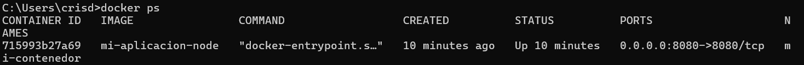
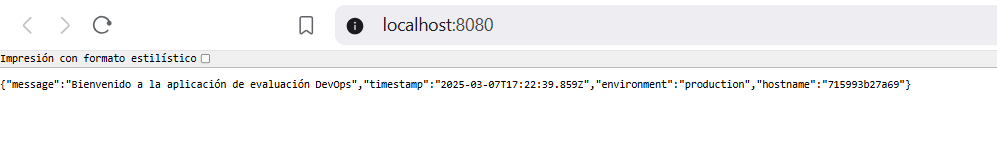
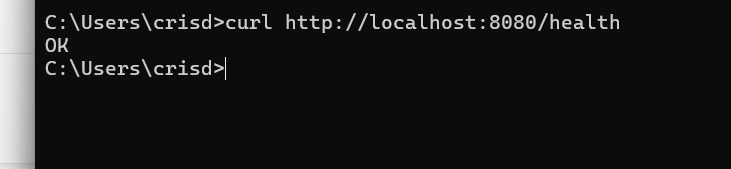

# ArquitecturaSFV-P1

# Evaluación Práctica - Ingeniería de Software V

## Información del Estudiante
- **Nombre: Cristian David Del Castillo Garcia**
- **Código: A00369953**
- **Fecha:7/03/2025**

## Resumen de la Solución
Se desarrolló una solución contenerizada utilizando Docker para ejecutar una aplicación Node.js. La aplicación incluye un endpoint principal (/) que muestra un mensaje de bienvenida y un endpoint de salud (/health) para verificar el estado del servicio. Se creó un Dockerfile optimizado y un script de automatización deploy.sh para facilitar el despliegue.

## Dockerfile
Se utilizó una imagen base ligera de Node.js (Alpine) para optimizar el tamaño del contenedor. Se configuró el WORKDIR, se copiaron los archivos necesarios y se instalaron las dependencias en modo producción. Finalmente, se expuso el puerto 8080 y se definió el comando de ejecución.

## Script de Automatización
**FROM node:18-alpine
WORKDIR /app
COPY package.json package-lock.json ./
RUN npm install --only=production
COPY . .
EXPOSE 8080
CMD ["node", "app.js"]**

## Principios DevOps Aplicados
1. Automatización: Se utilizó un script para evitar tareas manuales repetitivas.
2. Contenerización: Uso de Docker para asegurar consistencia en distintos entornos.
3. Integración y Despliegue Continuo: El script facilita una integración fluida en pipelines CI/CD.

## Captura de Pantalla

## Mejoras Futuras
1. Implementar un docker-compose.yml para mayor flexibilidad en la configuración.
2. Agregar pruebas unitarias y de integración en la aplicación.
3. Automatizar despliegue con GitHub Actions o Jenkins.

## Instrucciones para Ejecutar
1. CLONAR EL REPOSITORIO
git clone https://github.com/CrisDelCast/ParcialSOFT5.git
cd ParcialSOFT5
2. Construir y ejecutar la aplicación manualmente
docker build -t mi-aplicacion-node .
docker run -d -p 8080:8080 --name mi-contenedor mi-aplicacion-node
3. Usar el script 
./deploy.sh
